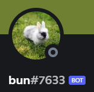

# Bun Bot

Bun is a Discord Bot written in Java. It is built on the Official Discord API for Java (`JDA4`). Bun's goal is to provide quality of life improvements to servers, voice and text channel moderation, and utility commands to interact with other APIs. 

## Commands!
Bun's functions can be accessed with a server independent prefix placed before a valid command. Bun's default prefix is `!`. The following is a list of commands at Bun's disposal, which can also be accessed with the `help` command.

### General
- `!greet`: Bun will send you a greeting message, mentioning you in a **text channel**.
- `!ping`: Bun will respond with the round-trip latency it took to handle your message. A helpful diagnosis tool!
- `!remindme`: A user can specify a message for Bun to remind them at a later time
- `!wiki`: Bun will look up a specified term from Wikipedia and return detailed information
- `!define`: Bun will look up a word in the English dictionary and return the definition
- `!weather`: Bun will look up the local weather conditions of a specified location
- `!math`: Bun can act as a calculator and perform arithmetic operations in a ***text channel***
- `!translate`: Bun will translate a message from the input language to the targetted language

### Moderation
- `!clear`: users with the `Manage Messages` permission are able to clear up to 99 messages within a **text channel**
- `!mute`: users with the `Manage Permissions` permission may mute any server member to prevent them from speaking in the server. Duration of muting can be specified. Re-type to toggle
- `!deafen`: users with the `Manage Permissions` permission may deafen any server member to prevent them from hearing audio in the server. Duration of deafening can be specified. Re-type to toggle
- `!ban`: users with the `Manage Members` permission may indefinitely ban a member from the server. Administrator may specify the length of the ban
- `!kick`: users with the `Manage Members` permission may remove a member from the server. To prevent the user from re-joining, please use the `!ban` command
- `!addrole`: add a role to the server
- `!delrole`: delete a role from the server
- `!remove-react`: remove reactions from specified number of previous messages

### For Fun
- `!coinflip`: Bun will "flip a coin" and return either Heads or Tails!
- `!avatar`: Bun will display the profile avatar of a member of the server
- `!roll`: By default Bun will return a random number from 1-10, or you can specify any number after `roll` for a larger or smaller range!

### Info
- `!serverinfo`: Bun will return information about the current server it is in
- `!userinfo`: When followed by the mention of another user who is present in the current server, it will return that user's information
- `!setrole`: User can request to be added to certain roles in the server

### Invite Bun To Your Server!
- Bun bot is currently undergoing a structure overhaul. Deployment has been put on pause.
